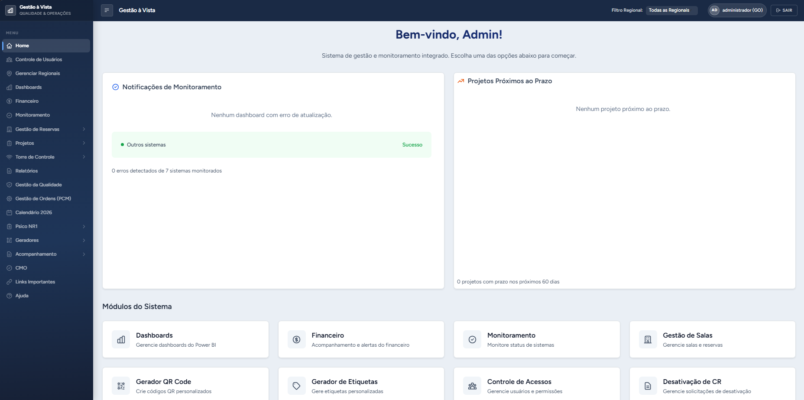
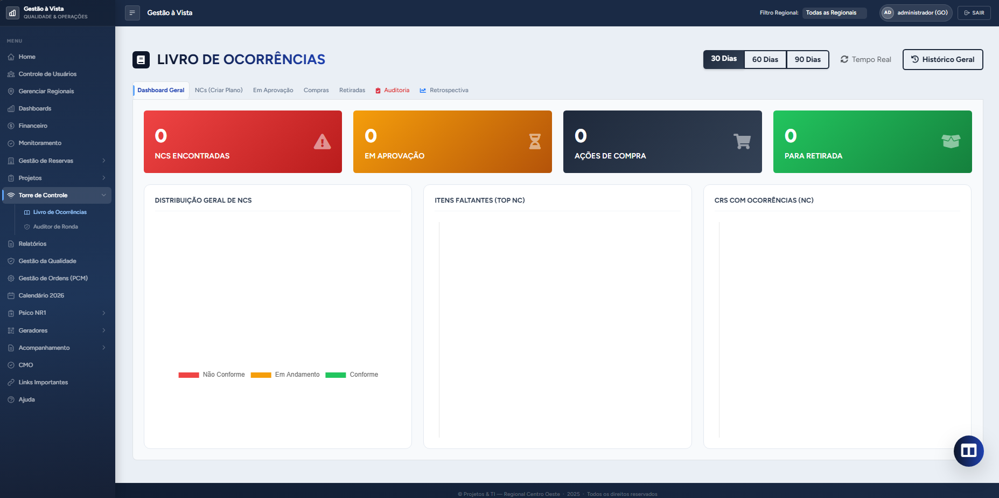
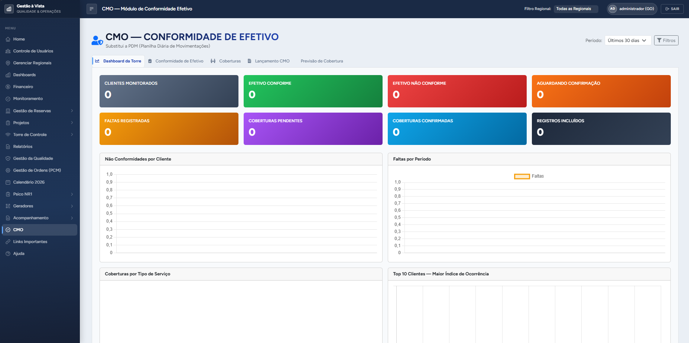
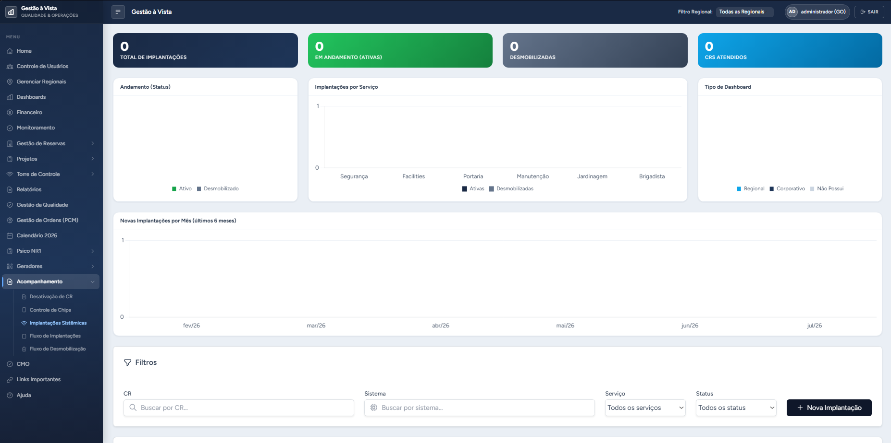
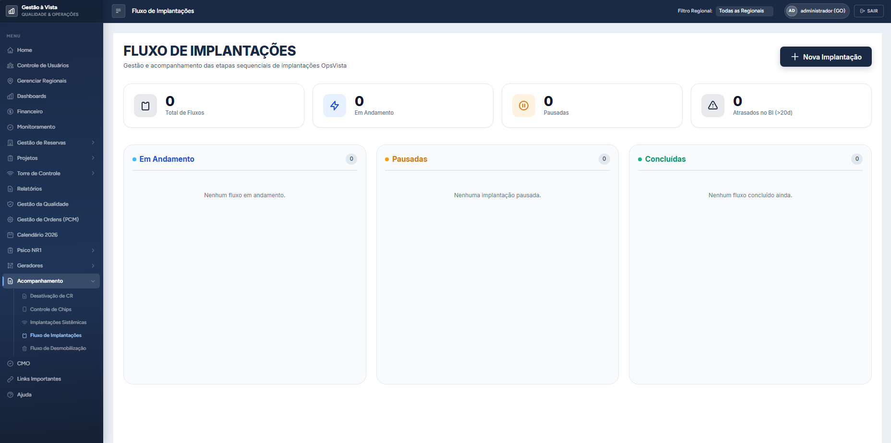

# Gestão à Vista

Sistema web de gestão operacional que desenvolvi para uma empresa de facilities/serviços de grande porte, usado em produção — hoje em escala nacional — por equipes de operação, qualidade e gestão das regionais da empresa pelo Brasil. Ele centraliza rotinas que antes viviam em planilhas e grupos de WhatsApp: registro de ocorrências, auditoria de rondas, reservas de sala, avaliação psicossocial NR-01, gestão de qualidade, controle de efetivo e por aí vai.



Este repositório é a **versão pública de portfólio**: o código é o mesmo que roda em produção, mas todos os dados, credenciais, nomes de clientes e marcas foram removidos ou substituídos por valores fictícios (`example.com`, "Grupo Exemplo" etc.). O histórico do git foi zerado pelo mesmo motivo. Nenhum dado real está incluído — o projeto sobe com um banco SQLite vazio e um usuário de demonstração.

## Por que esse projeto existe

A operação da empresa dependia de controles manuais: livro de ocorrências em papel, rondas sem evidência, indicadores montados à mão no fim do mês. A proposta do Gestão à Vista foi digitalizar esses fluxos um a um, dentro de um único sistema com controle de permissões por página e por papel (administrador, gerente, coordenador, supervisor).

O sistema nasceu como ferramenta de uma única regional. Com os resultados aparecendo na operação, o corporativo da empresa decidiu adotá-lo como padrão e expandi-lo para todas as regionais do Brasil — e essa virada de escala guiou as decisões de arquitetura mais importantes do projeto, a começar pelo roteamento multi-banco descrito mais abaixo.

O projeto cresceu módulo a módulo em cima de demandas reais — dá para perceber isso na estrutura. Alguns dos módulos principais:

- **Torre de Controle** — livro de ocorrências digital com trilha de auditoria (hash encadeado dos registros), planos de ação com fluxo de aprovação e compra, painel de reincidências e retrospectiva exportável em PDF/Excel.
- **Livro Ata com QR Code** — cada posto de trabalho ganha um QR Code; o supervisor escaneia e registra o turno dali mesmo, sem login no desktop. Gera relatórios mensais/consolidados e dispara notificações por WhatsApp (integração com a API da uazapi) e e-mail.
- **Avaliação Psicossocial NR-01** — módulo baseado no COPSOQ II: importa as planilhas de respostas, calcula scores por dimensão/GHE/ambiente e gera automaticamente o relatório Word e as planilhas de gestão que antes eram montados à mão. A engine de processamento vive no pacote [`psicossocial/`](psicossocial/) e também funciona via CLI, fora do Django.
- **Gestão da Qualidade** — treinamentos, visitas técnicas com evidências fotográficas, não conformidades e planos de ação, tudo com CRUD completo via API interna.
- **Gestão de Salas** — cadastro de unidades e salas, reservas com calendário e QR Code por sala.
- **CMO Efetivo** — controle de conformidade de efetivo: coberturas, trocas com fluxo de aprovação e marcação de lançamento em folha.
- **Planner e Explorer** — kanban de projetos com anexos e comentários, e um gerenciador de arquivos interno com editor (modo "código" com tema escuro).
- **Financeiro** — dashboard com ingestão de planilhas (pandas) e um assistente de análise que conversa com um LLM local via Ollama.
- **Utilitários de operação** — gerador de QR Codes e etiquetas em PDF, calendário anual de eventos, controle de chips, fluxos de implantação/desmobilização de contratos e um demo front-end de controle de ordens de manutenção (PCM).

O sistema também é um PWA (manifest + service worker), então funciona razoavelmente bem instalado no celular do supervisor em campo.

## Algumas telas

Os prints abaixo são da instância local de demonstração — banco vazio e nomes fictícios, como explicado no fim deste README:

| | |
|---|---|
|  |  |
| *Torre de Controle — Livro de Ocorrências* | *CMO — Conformidade de Efetivo* |
|  |  |
| *Acompanhamento de implantações sistêmicas* | *Fluxo de implantações em kanban* |

## Arquitetura

O ponto mais interessante do projeto é o **roteamento multi-banco por regional**. Cada regional da empresa tem seu próprio banco PostgreSQL, e o Django decide em runtime para onde mandar cada query:

- Um `DATABASE_ROUTER` customizado ([`Gestao_a_Vista/db_router.py`](Gestao_a_Vista/db_router.py)) direciona a query conforme a regional do usuário logado e o tipo de consulta.
- Os aliases de banco não são pré-declarados no settings: são registrados dinamicamente no startup e sob demanda ([`Gestao_a_Vista/db_manager.py`](Gestao_a_Vista/db_manager.py) + middleware), inclusive criando o banco físico da regional na primeira vez.
- Consultas pesadas de relatório vão para uma réplica somente-leitura (alias `readonly`), para não competir com a operação.

Outras decisões que valem menção:

- **Permissões por página**: cada usuário carrega um JSON de páginas liberadas; um decorator (`check_page_permission`) protege cada rota e o menu lateral é montado a partir do mesmo JSON. Simples e fácil de auditar.
- **Sessões e cache em camadas**: sessões em `cached_db`, cache file-based para dados gerais e um cache locmem separado só para autenticação/status online — o sistema atende operação em turno, então tinha bastante pressão de requisições repetitivas.
- **Senhas legadas**: a base veio de um sistema antigo com MD5; o Django está configurado com Argon2 como hasher principal e migra o hash automaticamente no primeiro login de cada usuário.
- **Geração de documentos**: PDF com reportlab, imagens e composição de QR com Pillow, planilhas com openpyxl/pandas e Word com python-docx (o relatório NR-01 substitui textos e tabelas dentro de um template .docx).
- **Deploy**: em produção roda com uWSGI atrás de Nginx. O repositório também traz um blueprint Docker Compose (web + PostgreSQL + Redis + Nginx + Prometheus + Grafana) para subir o stack completo em containers.

## Stack

Python 3.12 · Django 5.2 · PostgreSQL (produção) / SQLite (dev) · WhiteNoise · Pillow · reportlab · qrcode · openpyxl · pandas · python-docx · Ollama (assistente financeiro) · Docker/Nginx · pytest

## Rodando localmente

Sem nenhuma configuração, o projeto sobe em modo desenvolvimento com SQLite e e-mail no console:

```bash
python -m venv .venv
# Windows: .venv\Scripts\activate | Linux/macOS: source .venv/bin/activate
pip install -r requirements.txt
python setup_local.py
python manage.py runserver
```

Depois acesse http://127.0.0.1:8000/ e entre com `admin` / `admin12345`.

O `setup_local.py` roda os checks, aplica as migrations e cria o usuário administrador. Para usar PostgreSQL, e-mail SMTP ou a integração de WhatsApp, copie o [`.env.example`](.env.example) para `.env` e preencha as variáveis — sem elas o sistema simplesmente desativa essas integrações em vez de quebrar.

### Testes

```bash
pip install -r requirements-dev.txt
pytest
```

A suíte cobre models, views, forms e os serviços de QR Code/Livro Ata, além de testes de integração e uma camada Selenium opcional.

## Sobre esta versão pública

Para publicar o projeto sem expor a operação da empresa:

- Credenciais, tokens e IPs internos foram trocados por variáveis de ambiente (ver `.env.example`); nada sensível está hardcoded.
- Nomes de clientes, marcas do grupo e domínios reais foram substituídos por nomes fictícios. Se você encontrar "Grupo Exemplo", "OpsVista" ou "Innova", eram marcas reais no original.
- Planilhas, documentos e uploads reais ficaram de fora — em especial os dados de avaliação psicossocial, que são dados sensíveis de saúde (LGPD).
- O histórico do git foi reiniciado, porque o histórico original continha configurações internas.

O código é publicado para fins de avaliação técnica e portfólio. Todos os direitos reservados.

---

Daniel Augusto — [danielmel776@gmail.com](mailto:danielmel776@gmail.com)
